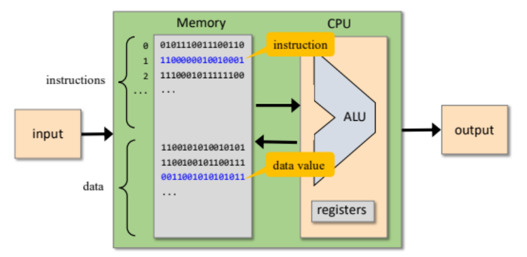
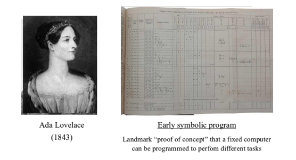
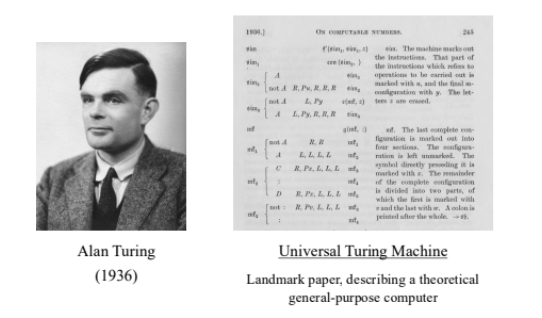
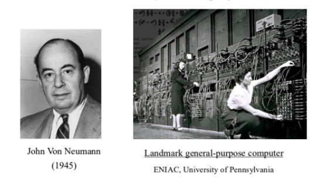
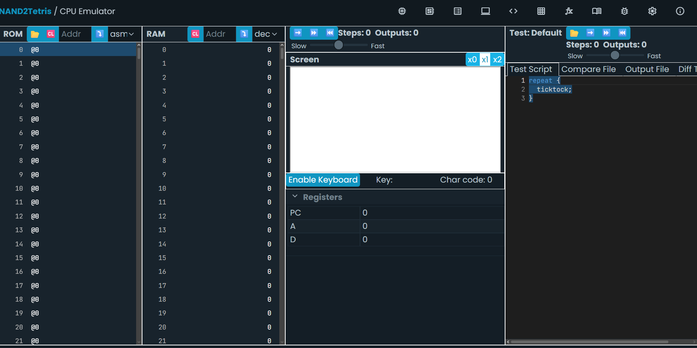

# Actividad 1

## Objetivo: ¿Qué se buscaba aprender o lograr?

Se busca que por medio del curso Nand2Tetris entendamos los fundamentos de la computación

## Proceso: Pasos que seguiste para completar la actividad

Entre al curso de Nand2Tetris, explore algunas cosas que ofrecian, en especial el "Proyecto 4" en donde se habla del lenguaje maquina

## Resultados: Lo que obtuviste o lograste

Logre identificar varios conceptos y tambien reforzar algunos datos que tenia un poco olvidados, tal como la Alan Turing y su maquina

## Aprendizaje: Conceptos nuevos que adquiriste

Reforce conceptos como la arquitectura de un computar, lo que era la memoria de programa y la memoria de datos, tambien como lo es la ALU (Unidad aritmetica logica), tambien los registros dentro de la CPU, los buses de direcciones y los buses de datos



Tambien el papel de algunas personas historicas, tal como fueron Ada Lovelace considerada la primera programadora de la historia



Tambien uno mas reconocido como Alan Turing y su maquina, la cual se dice que acortó la segunda guerra mundial



Por ultimo John Von Neuman que tambien es mencionado por su primera computadora electrica



Nos adentramos al IDE de Nand2Tetris en donde podemos interactuar como si fuera la RAM y la ROM de un computador, donde manejamos registros y tambien direcciones de memoria



En este IDE tambien aprendi algunas instrucciones que se pueden aplicar, por ejemplo:

```asm
@16
D=M
```

## Dificultades y soluciones: Obstáculos que encontraste y cómo los superaste

Tuve dificultad entendiendo el funcionamiento de cada una de las partes, como que tenia claro cual era cada una, pero se me dificulto entender como funcionaban con las otras partes

## Conclusiones: Reflexión sobre la importancia de lo aprendido

Aprendi muchos conceptos de como funcona un computador, y lo que mas me parecio importante fue poder interactaur con la RAM y la ROM
