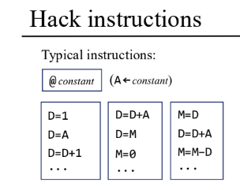
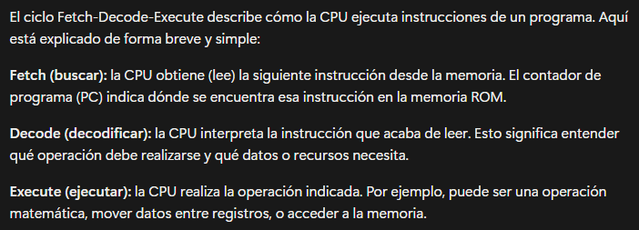

# Actividad 2

## Objetivo: ¿Qué se buscaba aprender o lograr?

Se busca el entendimiento de como funciona el ciclo ``fetch-decode-execute``, tambien se busca que experimentemos con el IDE aplicando este mismo ciclo

## Proceso: Pasos que seguiste para completar la actividad

Primero se nos dio a entender que el programa solo puede seguir un numero limitado de instrucciones.


(Estas son algunsa instruccione)

Tambien entendí como funcionaba el ciclo `fetch-decode-execute`



Al entender estas instrucciones limitadas y el ciclo dentro del IDE se nos pide analizar unas lineas de codigo en lenguaje emsamblador

```asm
			@1
			D=A
			@2
			D=D+A
			@16
			M=D
(END)  
			@END
			0;JMP
```

En donde llegué al siguiente analisis:
 
- `@1:` Nos ubicamos en la direccion de memoria **1**.
- `D=A:` Se guarda la dirección en el registro `D` en este caso se guardaria el numero **1**.
- `@2:` Ahora nos ubicamos en la direccion de memoria **2**.
- `D=D+A:` Ahora se guarda en el registro `D` la suma del valor que ya estaba guardado en el registro `D` que es **1** con la direccion de memoria `A` en donde estamos ubicados, en este caso el **2**, guardando en el registro `D` la suma de estos que seria **3**.
- `@16:` Ahora nos ubicamos en la dirección de memoria **16**.
- `M=D:` Ahora guardamos el valor que ya teniamos en `D` que es el **3** en el valor de memoria `M` de la direccion en la que estamos ubicados `@16`, guardando asi el numero **3** en el valor de memoria de esta dirección. 
- `(END):` Esta instruccion no se ejecuta como tal en el IDE, le esta diciendo al ensamblador que la siguiente istruccion se llamara **END**.
- `@END:` Aqui se ubicara en la direccion de memoria de la instruccion la cual se esta ejecutando. En este caso el ensamblador lo pondra como `@6` ya que es la instruccion **6**
- `0;JMP:` En esta instruccion el programa salta a la instruccion que se haya puesto antes de esta instruccion, la cual seria `@END` en donde entraria en un bucle infinito finalizando asi el programa.

En cada una de estas lineas sucede el ciclo `fetch-decode-execute`, tomemos como ejemplo la linea **4**, la instruccion que aparece aqui es `@16` el `fetch` sucede antes de llegar a esta instruccion, en donde antes se le da a la CPU la siguiente instruccion, `decode` este sucede luego de haber leido esta instruccion, en donde se interpreta la instruccion en donde entiende que operacion debe hacer y que datos necesita, en el `execute` la CPU realiza la operacion, en este caso el acceder a la memoria.

## Experimento

Ahora es tu turno. Crea un archivo llamado `program.asm` y copia el código del programa anterior. Ejecuta el programa en el simulador de la CPU Hack y observa cómo se comporta. 
- **¿Qué sucede?:** Se realiza la suma de dos direcciones de memoria para guardarlo en otra direccion de memoria.
- **¿Qué valor se almacena en la dirección de memoria 16?:** Se almacena el valor numero **3** 
- **¿Por qué crees que es ese valor?:** Se almacena este valor ya que anteriormente se dan instrucciones para sumar dos direcciones de menoria, la **1** y la **2** lo que nos da este resultado. 
- **¿Qué instrucciones se ejecutan en cada ciclo Fetch-Decode-Execute?:** En cada una de estas lineas sucede el ciclo `fetch-decode-execute`, tomemos como ejemplo la linea **4**, la instruccion que aparece aqui es `@16` el `fetch` sucede antes de llegar a esta instruccion, en donde antes se le da a la CPU la siguiente instruccion, `decode` este sucede luego de haber leido esta instruccion, en donde se interpreta la instruccion en donde entiende que operacion debe hacer y que datos necesita, en el `execute` la CPU realiza la operacion, en este caso el acceder a la memoria.
 
- **¿Qué cambios observas en el contenido de la memoria y los registros?:** Podemos ver como en donde ponemos la etiqueta `(END)` se transforma en el IDE por la instruccion `@6`
